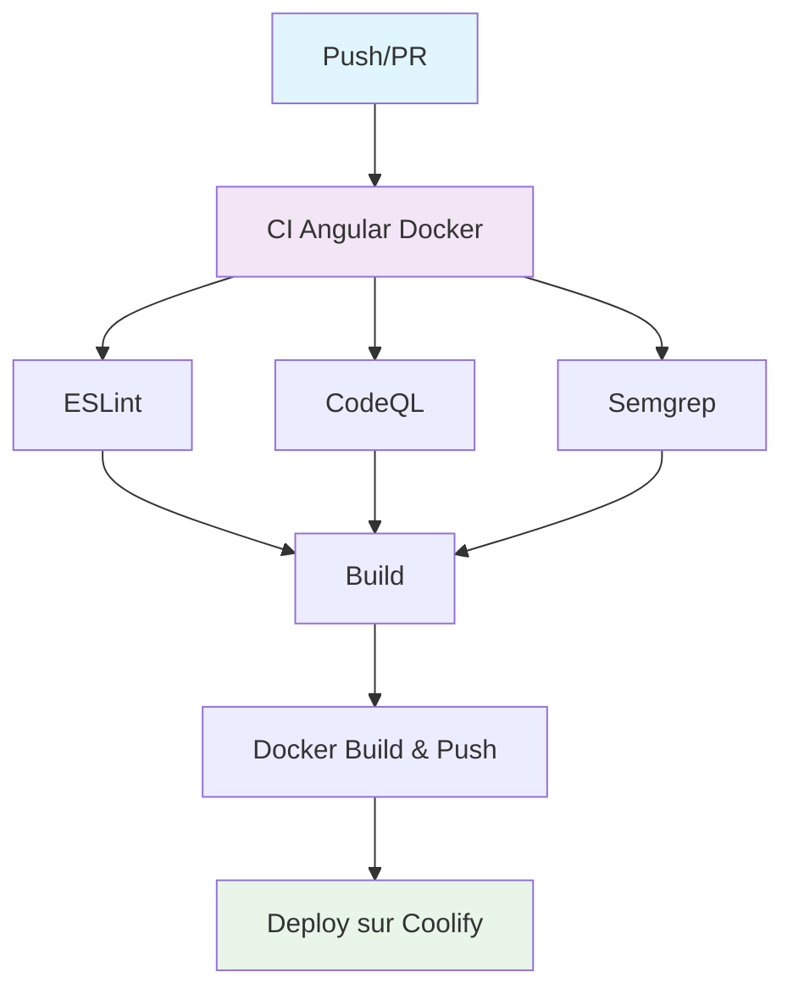

# Documentation des Variables CI/CD

## Vue d'ensemble

Ce document décrit les variables et configurations nécessaires pour le pipeline CI/CD du projet Angular avec les intégrations ESLint, CodeQL, Semgrep et le déploiement automatique.

## Architecture du Pipeline



## Variables d'environnement

### Variables globales

| Variable | Description | Valeur par défaut | Obligatoire |
|----------|-------------|-------------------|-------------|
| `NODE_VERSION` | Version de Node.js utilisée | `20` | Non |

## Variables GitHub Actions

### Variables automatiques (disponibles par défaut)

| Variable | Description | Utilisation |
|----------|-------------|-------------|
| `${{ github.actor }}` | Nom d'utilisateur qui a déclenché l'action | Authentification Docker |
| `${{ github.repository }}` | Nom du repository (owner/repo) | Tags Docker |
| `${{ github.sha }}` | Commit SHA | Tags Docker |
| `${{ github.token }}` | Token d'authentification GitHub | Authentification Docker |
| `${{ github.event.workflow_run.head_sha }}` | SHA du commit qui a déclenché la CI | Checkout du code pour déploiement |
| `${{ github.event.workflow_run.conclusion }}` | Résultat de la CI (success/failure) | Condition de déploiement |

### Secrets GitHub (à configurer dans les paramètres du repository)

| Secret | Description | Obligatoire | Configuration |
|--------|-------------|-------------|---------------|
| `GITHUB_TOKEN` | Token d'authentification GitHub | Non (auto-généré) | Automatique |
| `DOCKER_USERNAME` | Nom d'utilisateur Docker Hub | Oui | Manuel |
| `DOCKER_PASSWORD` | Mot de passe Docker Hub | Oui | Manuel |
| `COOLIFY_URL` | URL de l'instance Coolify | Oui | Manuel |
| `COOLIFY_API_KEY` | Clé API Coolify | Oui | Manuel |
| `COOLIFY_APPID_PREPROD_FRONTEND` | ID de l'app PREPROD dans Coolify | Oui | Manuel |
| `COOLIFY_APPID_PROD_FRONTEND` | ID de l'app PROD dans Coolify | Oui | Manuel |
| `IMAGE_NAME` | Nom de l'image Docker | Oui | Manuel |

## Workflows

### 1. CI Angular Docker (`ci.yml`)

**Déclenchement :**
- Push sur la branche `main`
- Pull requests

**Jobs :**
- `lint` : Analyse ESLint
- `codeql` : Analyse de sécurité CodeQL
- `semgrep` : Analyse de sécurité Semgrep
- `build` : Build Angular et création de l'artifact
- `docker` : Build et push de l'image Docker

### 2. Deploy sur Coolify (`deploy.yml`)

**Déclenchement :**
- Après la réussite du workflow "CI Angular Docker"
- Branches : `main` (PREPROD) et tags `v*` (PROD)

**Jobs :**
- `deploy` : Déploiement sur Coolify

## Permissions requises

### Job CodeQL
```yaml
permissions:
  actions: read
  contents: read
  security-events: write
```

### Job Deploy
```yaml
permissions:
  contents: read
  packages: write
```

## Configuration des actions

### ESLint

**Prérequis :**
- Script `lint` dans `package.json`
- Configuration ESLint (`.eslintrc.js`, `.eslintrc.json`, etc.)

**Variables utilisées :**
- `${{ env.NODE_VERSION }}` : Version de Node.js

### CodeQL

**Prérequis :**
- Aucun (utilise les règles par défaut)

**Variables utilisées :**
- `${{ matrix.language }}` : Langage analysé (JavaScript)
- `${{ env.NODE_VERSION }}` : Version de Node.js

**Configuration :**
- Langages supportés : JavaScript, TypeScript
- Stratégie : `fail-fast: false` (continue même si une langue échoue)

### Semgrep

**Prérequis :**
- Aucun (utilise les règles par défaut)

**Variables utilisées :**
- Aucune variable personnalisée

**Configuration :**
- Règles activées :
  - `p/security-audit` : Audit de sécurité
  - `p/owasp-top-ten` : Top 10 OWASP
  - `p/javascript` : Règles JavaScript
  - `p/typescript` : Règles TypeScript
  - `p/angular` : Règles Angular
- Format de sortie : SARIF pour GitHub Security

### Déploiement Coolify

**Prérequis :**
- Image Docker disponible dans le registry
- Configuration Coolify correcte

**Variables utilisées :**
- `${{ github.event.workflow_run.head_sha }}` : SHA du commit
- `${{ github.event.workflow_run.conclusion }}` : Résultat de la CI
- `${{ secrets.COOLIFY_URL }}` : URL Coolify
- `${{ secrets.COOLIFY_API_KEY }}` : Clé API
- `${{ secrets.COOLIFY_APPID_PREPROD_FRONTEND }}` : ID app PREPROD
- `${{ secrets.COOLIFY_APPID_PROD_FRONTEND }}` : ID app PROD
- `${{ secrets.IMAGE_NAME }}` : Nom de l'image

## Configuration du repository

### 1. Activer les alertes de sécurité

1. Aller dans **Settings** > **Security** > **Code security and analysis**
2. Activer **Dependency graph**
3. Activer **Dependabot alerts**
4. Activer **Code scanning**

### 2. Configurer les secrets

Dans **Settings** > **Secrets and variables** > **Actions** :

#### Secrets obligatoires pour le déploiement :
- `DOCKER_USERNAME` : Votre nom d'utilisateur Docker Hub
- `DOCKER_PASSWORD` : Votre mot de passe Docker Hub
- `COOLIFY_URL` : URL de votre instance Coolify (ex: `https://coolify.example.com`)
- `COOLIFY_API_KEY` : Clé API générée dans Coolify
- `COOLIFY_APPID_PREPROD_FRONTEND` : ID de l'application PREPROD
- `COOLIFY_APPID_PROD_FRONTEND` : ID de l'application PROD
- `IMAGE_NAME` : Nom de l'image Docker (ex: `ghcr.io/owner/repo/dvg_web_frontend`)

### 3. Scripts package.json requis

Assurez-vous que votre `package.json` contient :

```json
{
  "scripts": {
    "lint": "eslint . --ext .ts,.js",
    "build": "ng build"
  }
}
```

## Flux de déploiement

### PREPROD (branche main)
1. Push sur `main` → Déclenche la CI
2. CI exécute : ESLint, CodeQL, Semgrep, Build, Docker
3. Si CI réussit → Déclenche le déploiement
4. Déploiement sur l'environnement PREPROD

### PROD (tags)
1. Création d'un tag `v*` → Déclenche la CI
2. CI exécute : ESLint, CodeQL, Semgrep, Build, Docker
3. Si CI réussit → Déclenche le déploiement
4. Déploiement sur l'environnement PROD

## Dépannage

### Problèmes courants

1. **ESLint échoue** : Vérifiez que le script `lint` existe dans `package.json`
2. **CodeQL ne trouve pas de code** : Assurez-vous que le build produit des artefacts
3. **Semgrep ne génère pas de SARIF** : Vérifiez les permissions du repository
4. **Déploiement ne se lance pas** : Vérifiez que la CI s'est terminée avec succès
5. **Erreur d'authentification Coolify** : Vérifiez les secrets `COOLIFY_URL` et `COOLIFY_API_KEY`

### Logs utiles

- **CI** : Consultez l'onglet "Actions" pour voir les logs de chaque job
- **Déploiement** : Consultez les logs du workflow "Deploy sur Coolify"
- **Alertes de sécurité** : Consultez l'onglet "Security" > "Code scanning alerts"

## Sécurité

### Bonnes pratiques

1. **Ne jamais exposer de secrets** dans les logs
2. **Utiliser des tokens avec des permissions minimales**
3. **Réviser régulièrement les alertes de sécurité**
4. **Maintenir les dépendances à jour**
5. **Valider le code avant déploiement** (garantie par la CI)

### Alertes de sécurité

Les alertes sont automatiquement créées dans :
- **Security** > **Code scanning alerts** (CodeQL)
- **Security** > **Code scanning alerts** (Semgrep)

## Maintenance

### Mise à jour des actions

Les actions utilisées sont :
- `actions/checkout@v4`
- `actions/setup-node@v4`
- `actions/upload-artifact@v4`
- `docker/login-action@v3`
- `docker/build-push-action@v6`
- `github/codeql-action/init@v3`
- `github/codeql-action/analyze@v3`
- `github/codeql-action/upload-sarif@v3`
- `returntocorp/semgrep-action@v1`

### Surveillance

- Surveillez les alertes de sécurité régulièrement
- Vérifiez les échecs de build et de déploiement
- Maintenez les dépendances à jour
- Surveillez les logs Coolify pour les déploiements

## Exemples de configuration

### Configuration Coolify

1. **Créer une clé API** :
   - Aller dans Coolify > Settings > API Keys
   - Créer une nouvelle clé avec les permissions nécessaires

2. **Récupérer les IDs d'applications** :
   - Aller dans l'application Coolify
   - L'ID se trouve dans l'URL ou dans les paramètres

3. **Configurer l'image Docker** :
   - Format : `ghcr.io/owner/repo/dvg_web_frontend`
   - Remplacer par votre repository GitHub