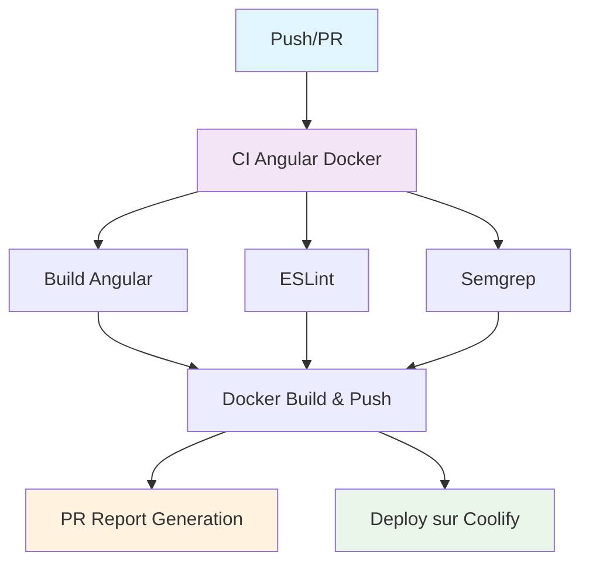

# Documentation des Variables CI/CD

## Vue d'ensemble

Ce document décrit les variables et configurations nécessaires pour le pipeline CI/CD du projet Angular avec les intégrations ESLint, Semgrep, Docker et le déploiement automatique sur Coolify, incluant le système de reporting automatique des Pull Requests.

## Architecture du Pipeline



## Variables d'environnement

### Variables globales

| Variable | Description | Valeur par défaut | Obligatoire |
|----------|-------------|-------------------|-------------|
| `NODE_VERSION` | Version de Node.js utilisée | `20` | Non |

## Variables GitHub Actions

### Variables automatiques (disponibles par défaut)

| Variable | Description | Utilisation |
|----------|-------------|-------------|
| `${{ github.actor }}` | Nom d'utilisateur qui a déclenché l'action | Authentification Docker, Reporting PR |
| `${{ github.repository }}` | Nom du repository (owner/repo) | Tags Docker, Liens documentation |
| `${{ github.sha }}` | Commit SHA | Tags Docker, Informations build |
| `${{ github.token }}` | Token d'authentification GitHub | Authentification Docker |
| `${{ github.head_ref }}` | Nom de la branche PR | Reporting PR, Liens documentation |
| `${{ github.event.workflow_run.head_sha }}` | SHA du commit qui a déclenché la CI | Checkout du code pour déploiement |
| `${{ github.event.workflow_run.conclusion }}` | Résultat de la CI (success/failure) | Condition de déploiement |
| `${{ github.server_url }}` | URL du serveur GitHub | Métadonnées Docker |

### Secrets GitHub (à configurer dans les paramètres du repository)

| Secret | Description | Obligatoire | Configuration |
|--------|-------------|-------------|---------------|
| `GITHUB_TOKEN` | Token d'authentification GitHub | Non (auto-généré) | Automatique |
| `COOLIFY_URL` | URL de l'instance Coolify | Oui | Manuel |
| `COOLIFY_API_KEY` | Clé API Coolify | Oui | Manuel |
| `COOLIFY_APPID_PREPROD_FRONTEND` | ID de l'app PREPROD dans Coolify | Oui | Manuel |
| `COOLIFY_APPID_PROD_FRONTEND` | ID de l'app PROD dans Coolify | Oui | Manuel |
| `IMAGE_NAME` | Nom de l'image Docker | Oui | Manuel |
| `SEMGREP_APP_TOKEN` | Token Semgrep pour commentaires PR | Non | Manuel (optionnel) |

## Workflows

### 1. CI Angular Docker (`ci.yml`)

**Déclenchement :**
- Push sur la branche `main`
- Push sur les tags `v*`
- Pull requests

**Jobs :**
- `build` : Build Angular et création de l'artifact
- `lint` : Analyse ESLint de la qualité du code
- `semgrep` : Analyse de sécurité Semgrep
- `docker` : Build et push de l'image Docker sur GitHub Container Registry
- `pr-report` : Génération automatique du rapport de build dans les PR (uniquement sur PR)

### 2. Deploy sur Coolify (`deploy.yml`)

**Déclenchement :**
- Après la réussite du workflow "CI Angular Docker"
- Branches : `main` (PREPROD) et tags `v*` (PROD)

**Jobs :**
- `deploiement` : Déploiement sécurisé sur Coolify (sans checkout du code PR)

## Permissions requises

### Job Semgrep
```yaml
permissions:
  contents: read
  security-events: write
```

### Job Docker
```yaml
permissions:
  contents: read
  packages: write
```

### Job PR Report
```yaml
permissions:
  contents: read
  issues: write
  pull-requests: write
```

### Job Deploy
```yaml
permissions:
  contents: read
  packages: read
```

## Configuration des actions

### ESLint

**Prérequis :**
- Script `lint` dans `package.json`
- Configuration ESLint (`.eslintrc.js`, `.eslintrc.json`, etc.)

**Variables utilisées :**
- `${{ env.NODE_VERSION }}` : Version de Node.js

### Build Angular

**Prérequis :**
- Script `build` dans `package.json`
- Configuration Angular (`angular.json`)

**Variables utilisées :**
- `${{ env.NODE_VERSION }}` : Version de Node.js
- `${{ steps.build.outputs.build-path }}` : Chemin de sortie du build

**Configuration :**
- Configuration : `production`
- Artifact : `angular-dist` (dossier `dist/`)

### Semgrep

**Prérequis :**
- Aucun (utilise les règles par défaut)

**Variables utilisées :**
- `${{ secrets.SEMGREP_APP_TOKEN }}` : Token pour commentaires PR (optionnel)

**Configuration :**
- Règles activées :
  - `p/security-audit` : Audit de sécurité
  - `p/owasp-top-ten` : Top 10 OWASP
  - `p/javascript` : Règles JavaScript
  - `p/typescript` : Règles TypeScript
- Commentaires PR : Activés
- Format de sortie : SARIF pour GitHub Security

### Docker Build & Push

**Prérequis :**
- Dockerfile présent dans le projet
- Configuration nginx pour l'image finale

**Variables utilisées :**
- `${{ github.actor }}` : Nom d'utilisateur GitHub
- `${{ secrets.GITHUB_TOKEN }}` : Token d'authentification
- `${{ github.repository }}` : Nom du repository
- `${{ github.sha }}` : SHA du commit

**Configuration :**
- Registry : GitHub Container Registry (`ghcr.io`)
- Tags : `ghcr.io/${{ github.repository }}/dvg_web_frontend:${{ github.sha }}`
- Labels : Métadonnées OCI complètes
- Cache : GitHub Actions cache

### PR Report Generation

**Prérequis :**
- Job `pr-report` configuré
- Permissions `issues: write` et `pull-requests: write`

**Variables utilisées :**
- `${{ needs.build.result }}` : Statut du build
- `${{ needs.lint.result }}` : Statut du linter
- `${{ needs.semgrep.result }}` : Statut de Semgrep
- `${{ needs.docker.outputs.image-tag }}` : Tag de l'image Docker
- `${{ github.sha }}` : SHA du commit
- `${{ github.head_ref }}` : Nom de la branche
- `${{ github.actor }}` : Utilisateur qui a déclenché

**Configuration :**
- Déclenchement : Uniquement sur les Pull Requests
- Comportement : Met à jour les commentaires existants
- Contenu : Rapport détaillé avec statuts, commandes Docker, liens documentation

### Déploiement Coolify

**Prérequis :**
- Image Docker disponible dans le registry
- Configuration Coolify correcte

**Variables utilisées :**
- `${{ github.event.workflow_run.head_sha }}` : SHA du commit (récupéré sans checkout)
- `${{ github.event.workflow_run.conclusion }}` : Résultat de la CI
- `${{ secrets.COOLIFY_URL }}` : URL Coolify
- `${{ secrets.COOLIFY_API_KEY }}` : Clé API
- `${{ secrets.COOLIFY_APPID_PREPROD_FRONTEND }}` : ID app PREPROD
- `${{ secrets.COOLIFY_APPID_PROD_FRONTEND }}` : ID app PROD
- `${{ secrets.IMAGE_NAME }}` : Nom de l'image

**Configuration :**
- Sécurité : Pas de checkout du code PR (évite les failles de sécurité)
- Méthode : Récupération sécurisée des informations de commit
- Déploiement : Via API Coolify avec authentification Bearer

## Configuration du repository

### 1. Activer les alertes de sécurité

1. Aller dans **Settings** > **Security** > **Code security and analysis**
2. Activer **Dependency graph**
3. Activer **Dependabot alerts**
4. Activer **Code scanning**

### 2. Configurer les secrets

Dans **Settings** > **Secrets and variables** > **Actions** :

#### Secrets obligatoires pour le déploiement :
- `COOLIFY_URL` : URL de votre instance Coolify (ex: `https://coolify.example.com`)
- `COOLIFY_API_KEY` : Clé API générée dans Coolify
- `COOLIFY_APPID_PREPROD_FRONTEND` : ID de l'application PREPROD
- `COOLIFY_APPID_PROD_FRONTEND` : ID de l'application PROD
- `IMAGE_NAME` : Nom de l'image Docker (ex: `ghcr.io/owner/repo/dvg_web_frontend`)

#### Secrets optionnels :
- `SEMGREP_APP_TOKEN` : Token Semgrep pour commentaires PR détaillés

### 3. Scripts package.json requis

Assurez-vous que votre `package.json` contient :

```json
{
  "scripts": {
    "lint": "eslint .",
    "build": "ng build --configuration=production"
  }
}
```

## Flux de déploiement

### PREPROD (branche main)
1. Push sur `main` → Déclenche la CI
2. CI exécute : Build Angular, ESLint, Semgrep, Docker Build & Push
3. Si CI réussit → Déclenche le déploiement sécurisé
4. Déploiement sur l'environnement PREPROD via API Coolify

### PROD (tags)
1. Création d'un tag `v*` → Déclenche la CI
2. CI exécute : Build Angular, ESLint, Semgrep, Docker Build & Push
3. Si CI réussit → Déclenche le déploiement sécurisé
4. Déploiement sur l'environnement PROD via API Coolify

### Pull Requests
1. Ouverture/modification de PR → Déclenche la CI
2. CI exécute : Build Angular, ESLint, Semgrep, Docker Build & Push
3. Génération automatique du rapport de build dans la PR
4. Rapport inclut : statuts, commandes Docker, liens documentation

## Dépannage

### Problèmes courants

1. **ESLint échoue** : Vérifiez que le script `lint` existe dans `package.json`
2. **Build Angular échoue** : Vérifiez la configuration `angular.json` et les dépendances
3. **Semgrep ne génère pas de SARIF** : Vérifiez les permissions du repository
4. **Docker build échoue** : Vérifiez le Dockerfile et la configuration nginx
5. **Déploiement ne se lance pas** : Vérifiez que la CI s'est terminée avec succès
6. **Erreur d'authentification Coolify** : Vérifiez les secrets `COOLIFY_URL` et `COOLIFY_API_KEY`
7. **Rapport PR ne s'affiche pas** : Vérifiez les permissions `issues: write` et `pull-requests: write`
8. **Image Docker non trouvée** : Vérifiez que le job `docker` s'est exécuté avec succès

### Logs utiles

- **CI** : Consultez l'onglet "Actions" pour voir les logs de chaque job
- **Déploiement** : Consultez les logs du workflow "Deploy sur Coolify"
- **Alertes de sécurité** : Consultez l'onglet "Security" > "Code scanning alerts"
- **Rapports PR** : Consultez les commentaires automatiques dans les Pull Requests
- **Images Docker** : Consultez l'onglet "Packages" pour voir les images publiées

## Sécurité

### Bonnes pratiques

1. **Ne jamais exposer de secrets** dans les logs
2. **Utiliser des tokens avec des permissions minimales**
3. **Réviser régulièrement les alertes de sécurité**
4. **Maintenir les dépendances à jour**
5. **Valider le code avant déploiement** (garantie par la CI)
6. **Utiliser des images Docker sécurisées** (utilisateur non-root, headers de sécurité)
7. **Éviter le checkout du code PR** dans les workflows de déploiement
8. **Surveiller les rapports de build** dans les Pull Requests

### Alertes de sécurité

Les alertes sont automatiquement créées dans :
- **Security** > **Code scanning alerts** (Semgrep)
- **Security** > **Dependabot alerts** (dépendances)
- **Packages** > **Security advisories** (images Docker)

## Maintenance

### Mise à jour des actions

Les actions utilisées sont :
- `actions/checkout@v4`
- `actions/setup-node@v4`
- `actions/upload-artifact@v4`
- `actions/download-artifact@v4`
- `docker/login-action@v3`
- `docker/setup-buildx-action@v3`
- `docker/build-push-action@v6`
- `semgrep/semgrep-action@v1`
- `actions/github-script@v7`

### Surveillance

- Surveillez les alertes de sécurité régulièrement
- Vérifiez les échecs de build et de déploiement
- Maintenez les dépendances à jour
- Surveillez les logs Coolify pour les déploiements
- Consultez les rapports automatiques dans les Pull Requests
- Vérifiez la qualité des images Docker publiées

## Exemples de configuration

### Configuration Coolify

1. **Créer une clé API** :
   - Aller dans Coolify > Settings > API Keys
   - Créer une nouvelle clé avec les permissions nécessaires

2. **Récupérer les IDs d'applications** :
   - Aller dans l'application Coolify
   - L'ID se trouve dans l'URL ou dans les paramètres

3. **Configurer l'image Docker** :
   - Format : `ghcr.io/owner/repo/dvg_web_frontend`
   - Remplacer par votre repository GitHub

## Fonctionnalités avancées

### Système de reporting PR

Le pipeline génère automatiquement des rapports détaillés dans les Pull Requests incluant :

- **Statut global** : Succès/Échec avec indicateurs visuels
- **Détails par composant** : Build, Linter, Sécurité, Docker
- **Informations Docker** : Tag d'image, commandes de pull/run
- **Métadonnées** : Commit, branche, utilisateur, timestamp
- **Liens de documentation** : Guides de déploiement et configuration

### Sécurité Docker

L'image Docker est construite avec :
- **Utilisateur non-root** : `nginx-user` (UID 1001)
- **Headers de sécurité** : X-Frame-Options, CSP, HSTS, etc.
- **Configuration nginx optimisée** : Compression, cache, rate limiting
- **Health checks** : Endpoint `/health` pour le monitoring

### Déploiement sécurisé

Le workflow de déploiement :
- **Évite le checkout du code PR** (prévient les failles de sécurité)
- **Récupère les informations de commit** de manière sécurisée
- **Utilise l'API Coolify** avec authentification Bearer
- **Supporte les environnements** PREPROD et PROD