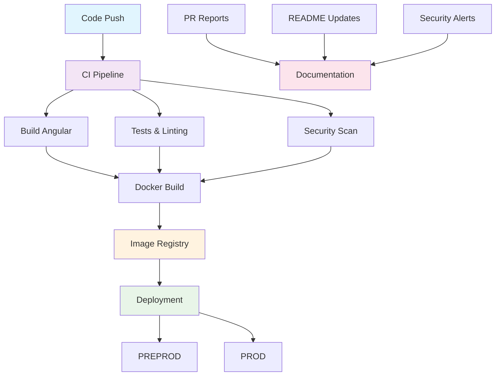

# 🚀 DevOps - Frontend Angular

## Vue d'ensemble

Cette section documente l'ensemble de l'infrastructure DevOps pour le frontend Angular, incluant la CI/CD, le déploiement, ~~la sécurité et la maintenance~~.

## 📋 Table des matières

### 🔄 [CI/CD Pipeline](ci-cd-pipeline.md)
- Architecture du pipeline
- Workflows GitHub Actions
- Gestion des environnements
- Stratégies de déploiement

### 🐳 [Déploiement](deployment.md)
- Guide de déploiement
- Configuration des environnements
- Commandes Docker
- Dépannage

## 🏗️ Architecture DevOps

## 🔧 Outils utilisés

| Catégorie | Outils | Description |
|-----------|--------|-------------|
| **CI/CD** | GitHub Actions | Pipeline d'intégration continue |
| **Build** | Angular CLI, npm | Compilation et packaging |
| **Tests** | ESLint, Semgrep | Qualité et sécurité du code |
| **Containers** | Docker, nginx | Containerisation et serveur web |
| **Registry** | GitHub Container Registry | Stockage des images |
| **Deploy** | Coolify API | Déploiement automatique |
| **Monitoring** | GitHub API | Rapports et métriques |
