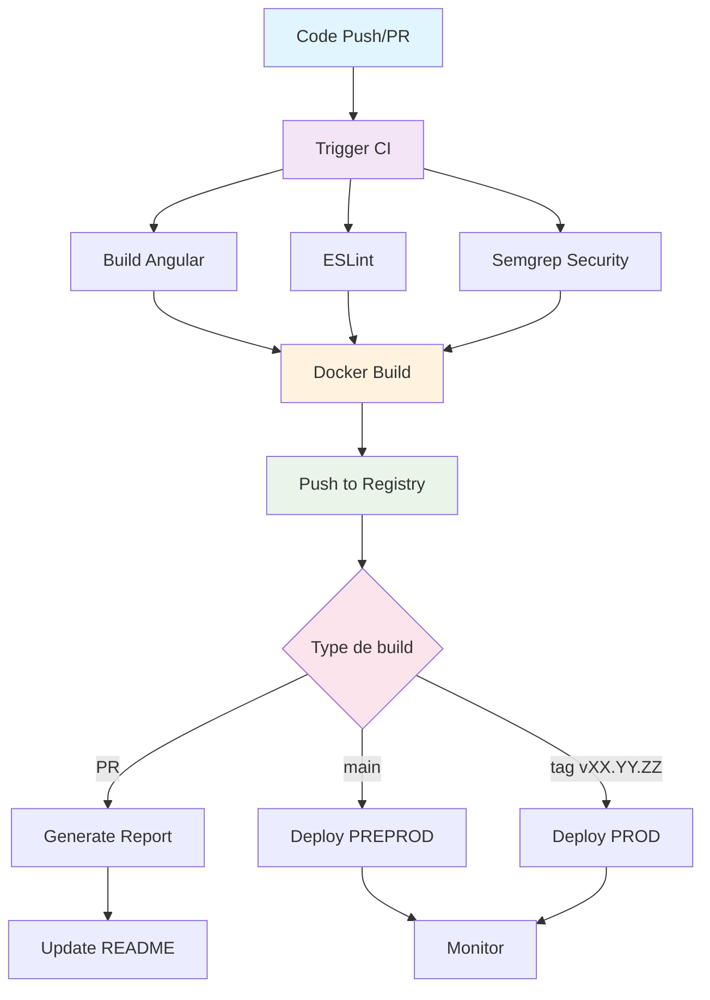

# 🔄 CI/CD Pipeline

## Vue d'ensemble

Le pipeline CI/CD automatise la construction, les tests, la sécurité et le déploiement de l'application frontend Angular.

## 🏗️ Architecture du pipeline



## 📋 Workflows

### 1. CI Angular Docker (`ci.yml`)

**Déclenchement :**
- Push sur `main`, `develop`
- Push sur les tags `vXX.YY.ZZ`
- Pull requests

**Jobs :**

| Job | Description | Dépendances |
|-----|-------------|-------------|
| `build` | Compilation Angular production | - |
| `lint` | Analyse ESLint | `build` |
| `semgrep` | Analyse de sécurité | `build` |
| `docker` | Build et push image Docker | `lint`, `semgrep` |
| `pr-report` | Génération rapport PR | `build`, `lint`, `semgrep`, `docker` |

### 2. Deploy sur Coolify (`deploy.yml`)

**Déclenchement :**
- Après succès de `ci.yml`
- Branches : `main` (PREPROD), tags `vXX.YY.ZZ` (PROD)

**Jobs :**

| Job | Description | Environnement |
|-----|-------------|---------------|
| `deploiement` | Déploiement sécurisé | PREPROD/PROD |

## 🏷️ Stratégie de tagging

| Contexte | Tag | Description |
|----------|-----|-------------|
| **Pull Request** | `unstable` | Version de test |
| **Branche develop** | `dev` | Version de développement |
| **Branche main** | `RC` | Release Candidate |
| **Tag vXX.YY.ZZ** | `RELEASE` | Version de production |

## 🔧 Configuration

### Variables d'environnement

```yaml
env:
  NODE_VERSION: 20
  BUILD_STATUS: ${{ needs.build.result }}
  LINT_STATUS: ${{ needs.lint.result }}
  SEMGREP_STATUS: ${{ needs.semgrep.result }}
  DOCKER_STATUS: ${{ needs.docker.result }}
  IMAGE_TAG: ${{ needs.docker.outputs.image-tag }}
  WORKFLOW_TAG: ${{ needs.docker.outputs.workflow-tag }}
  TAG_SUFFIX: ${{ needs.docker.outputs.tag-suffix }}
```

### Secrets requis

| Secret | Description | Obligatoire |
|--------|-------------|-------------|
| `COOLIFY_URL` | URL instance Coolify | ✅ |
| `COOLIFY_API_KEY` | Clé API Coolify | ✅ |
| `COOLIFY_APPID_PREPROD_FRONTEND` | ID app PREPROD | ✅ |
| `COOLIFY_APPID_PROD_FRONTEND` | ID app PROD | ✅ |
| `IMAGE_NAME` | Nom de l'image Docker | ✅ |
| `SEMGREP_APP_TOKEN` | Token Semgrep (optionnel) | ❌ |

## 🛠️ Scripts automatisés

### Scripts dans `.github/scripts/`

| Script | Fonction | Usage |
|--------|----------|-------|
| `determine-tags.sh` | Détermine les tags Docker | Job `docker` |
| `generate-pr-report.sh` | Génère rapport PR | Job `pr-report` |
| `publish-pr-comment.js` | Publie commentaire PR | Job `pr-report` |
| `check-infinite-loop.sh` | Évite les boucles infinies | Job `pr-report` |
| `update-readme.sh` | Met à jour README | Job `pr-report` |
| `commit-and-push.sh` | Commit et push sécurisé | Job `pr-report` |

## 🔍 Qualité et sécurité

### Tests automatisés

1. **Build Angular** : Compilation en mode production
2. **ESLint** : Analyse de qualité du code
3. **Semgrep** : Analyse de sécurité
4. **Docker** : Construction d'image sécurisée

### Critères de succès

- ✅ Build Angular réussi
- ✅ ESLint sans erreur
- ✅ Semgrep sans vulnérabilité critique
- ✅ Image Docker construite et poussée

### Mise à jour README

Le README est automatiquement mis à jour avec :

- **Informations de build** en temps réel
- **Statuts des analyses** (Build, ESLint, Semgrep)
- **Commandes Docker** prêtes à l'emploi
- **Métadonnées** du build

## 🚀 Déploiement

### Environnements

| Environnement | Déclencheur | Tag Docker | Description |
|---------------|-------------|------------|-------------|
| **PREPROD** | Push sur `main` | `RC` | Tests de recette |
| **PROD** | Tag `vXX.YY.ZZ` | `RELEASE` | Production |


---

*Pour plus de détails, voir [Déploiement](deployment.md).*
