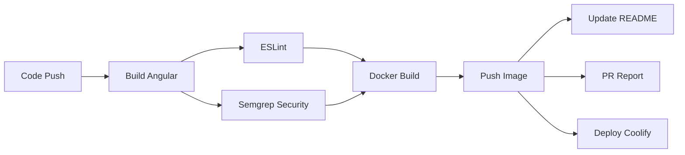

# 🚀 Guide de Déploiement - Frontend Angular

## Vue d'ensemble du workflow

Ce projet utilise un pipeline CI/CD automatisé avec GitHub Actions pour construire, tester et déployer l'application frontend Angular.

## 🔄 Workflow de déploiement

### 1. Déclenchement automatique

Le pipeline se déclenche automatiquement sur :
- **Pull Requests** → Build + Tests + Image `unstable`
- **Push sur `develop`** → Build + Tests + Image `dev`
- **Push sur `main`** → Build + Tests + Image `RC` + Déploiement PREPROD
- **Tags `vXX.YY.ZZ`** → Build + Tests + Image `RELEASE` + Déploiement PROD

### 2. Étapes du pipeline



### 3. Types d'images Docker

| Contexte | Tag | Description |
|----------|-----|-------------|
| **Pull Request** | `unstable` | Version de test |
| **Branche develop** | `dev` | Version de développement |
| **Branche main** | `RC` | Release Candidate |
| **Tag vXX.YY.ZZ*** | `RELEASE` | Version de production |

## 🐳 Utilisation des images Docker

### Récupérer une image

```bash
# Image spécifique (par commit)
docker pull ghcr.io/teamdivergentes/website_frontend/dvg_web_frontend:COMMIT_SHA

# Image par type de build
# Dernières versions (recommandé)
docker pull ghcr.io/teamdivergentes/website_frontend/dvg_web_frontend:unstable
docker pull ghcr.io/teamdivergentes/website_frontend/dvg_web_frontend:dev
docker pull ghcr.io/teamdivergentes/website_frontend/dvg_web_frontend:RC
docker pull ghcr.io/teamdivergentes/website_frontend/dvg_web_frontend:RELEASE

# Versions spécifiques avec SHA
docker pull ghcr.io/teamdivergentes/website_frontend/dvg_web_frontend:1.0.0-unstable-abc1234
docker pull ghcr.io/teamdivergentes/website_frontend/dvg_web_frontend:1.0.0-dev-abc1234
docker pull ghcr.io/teamdivergentes/website_frontend/dvg_web_frontend:1.0.0-RC-abc1234
docker pull ghcr.io/teamdivergentes/website_frontend/dvg_web_frontend:1.0.0-RELEASE
```

### Lancer l'application

```bash
# Lancer l'image
docker run -d -p 8080:80 --name frontend ghcr.io/teamdivergentes/website_frontend/dvg_web_frontend:unstable

# Accéder à l'application
open http://localhost:8080
```

### Commandes utiles

```bash
# Voir les logs
docker logs frontend

# Arrêter l'application
docker stop frontend

# Redémarrer l'application
docker restart frontend

# Supprimer l'application
docker rm frontend
```

## 🔧 Déploiement automatique

### Environnements

- **PREPROD** : Déploiement automatique sur `main`
- **PROD** : Déploiement automatique sur les tags `vXX.YY.ZZ`

### Configuration requise

Les secrets suivants doivent être configurés dans GitHub :

| Secret | Description |
|--------|-------------|
| `COOLIFY_URL` | URL de votre instance Coolify |
| `COOLIFY_API_KEY` | Clé API Coolify |
| `COOLIFY_APPID_PREPROD_FRONTEND` | ID de l'app PREPROD |
| `COOLIFY_APPID_PROD_FRONTEND` | ID de l'app PROD |
| `IMAGE_NAME` | Nom de l'image Docker |

## 📊 Monitoring et rapports

### Rapports automatiques

- **Pull Requests** : Rapport détaillé avec statuts et commandes Docker
- **README** : Mise à jour automatique avec informations de build
- **Logs** : Disponibles dans l'onglet "Actions" de GitHub

### Informations de build

Chaque build génère :
- ✅ Statut des tests (Build, ESLint, Semgrep)
- 🐳 Tags Docker (spécifique + workflow)
- 📅 Date/heure du build
- 👤 Utilisateur qui a déclenché
- 🔗 Liens vers la documentation

## 🛠️ Développement local

### Prérequis

- Node.js 20+
- Docker (optionnel)

### Commandes de développement

```bash
# Installation
npm install

# Développement
npm start

# Build
npm run build

# Tests
npm run lint
npm test
```

### Docker local

```bash
# Construire l'image localement
docker build -t dvg-frontend:local .

# Lancer l'image
docker run -d -p 8080:80 --name dvg-frontend dvg-frontend:local
```

## 🔍 Dépannage

### Problèmes courants

1. **Build échoue** : Vérifiez les logs dans GitHub Actions
2. **Image non trouvée** : Vérifiez que le job Docker s'est exécuté
3. **Déploiement échoue** : Vérifiez les secrets Coolify
4. **Rapport PR manquant** : Vérifiez les permissions du workflow

### Logs utiles

- **GitHub Actions** : Onglet "Actions" du repository
- **Docker** : `docker logs frontend`
- **Coolify** : Interface d'administration Coolify

## 📚 Documentation complète

- [Dockerfile](Dockerfile) - Configuration de l'image
- [nginx.conf](nginx.conf) - Configuration du serveur web
- [devsecops.yml](devsecops.yml) - Configuration des gates de qualité et sécurité

---

*Pour plus de détails, voir [CI-CD pipeline](ci-cd-pipeline.md).*
